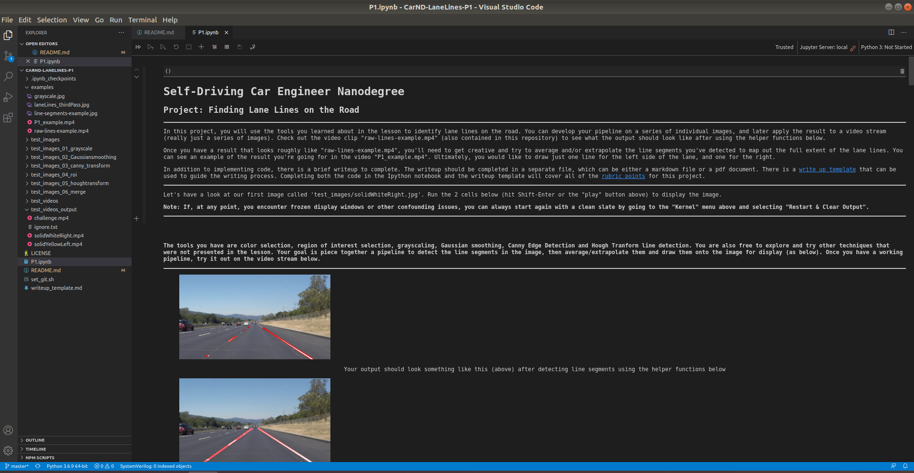
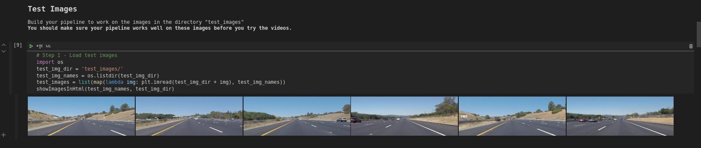

# **Finding Lane Lines on the Road** 

Overview
---

When we drive, we use our eyes to decide where to go.  The lines on the road that show us where the lanes are act as our constant reference for where to steer the vehicle.  Naturally, one of the first things we would like to do in developing a self-driving car is to automatically detect lane lines using an algorithm.

In this project you will detect lane lines in images using Python and OpenCV.  OpenCV means "Open-Source Computer Vision", which is a package that has many useful tools for analyzing images.  

The Project
---
**Step 1:** Installing Visual Studio Code as your working IDE - [Visual Studio Code](https://code.visualstudio.com/)

**Step 2:** Set up the [CarND Term1 Starter Kit](https://github.com/udacity/CarND-Term1-Starter-Kit/blob/master/README.md) if you haven't already.

**Step 3:** Open the code in a Jupyter Notebook - Visual Studio Code

**Step 4:** Open P1.ipynb and run Lane finding pipelines

**Lane finding pipelines Block Diagram**

**Lane finding pipelines Execution**

 

